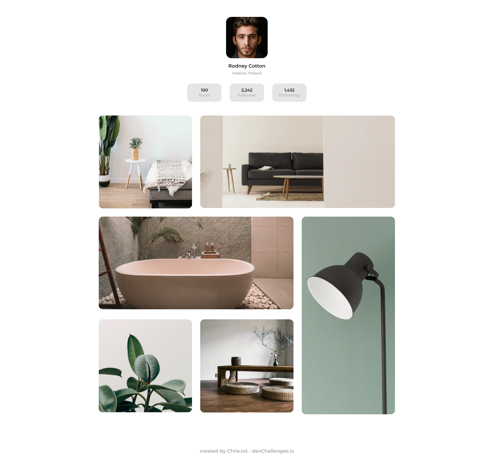

<!-- Please update value in the {}  -->

<h1 align="center">Gallery photos</h1>

   Solution for a challenge from  <a href="http://devchallenges.io" target="_blank">Devchallenges.io</a>.

  <h3>
    <a href="https://{your-demo-link.your-domain}">
      Demo
    </a>
     | 
    <a href="https://{your-url-to-the-solution}">
      Solution
    </a>
     | 
    <a href="https://devchallenges.io/challenges/gcbWLxG6wdennelX7b8I">
      Challenge
    </a>
  </h3>

<!-- TABLE OF CONTENTS -->

## Table of Contents

- [Overview](#overview)
  - [Built With](#built-with)
- [Contact](#contact)

<!-- OVERVIEW -->

## Overview

### Built With

<!-- This section should list any major frameworks that you built your project using. Here are a few examples.-->

- [Html](https://developer.mozilla.org/fr/docs/Web/HTML)
- [Css](https://developer.mozilla.org/fr/docs/Web/CSS)
- [Sass](https://sass-lang.com/guide)

## Contact

- GitHub [ChriiSsNd](https://github.com/ChriiSsNd)
- Twitter [ChriisS20](https://twitter.com/ChriisS20)
